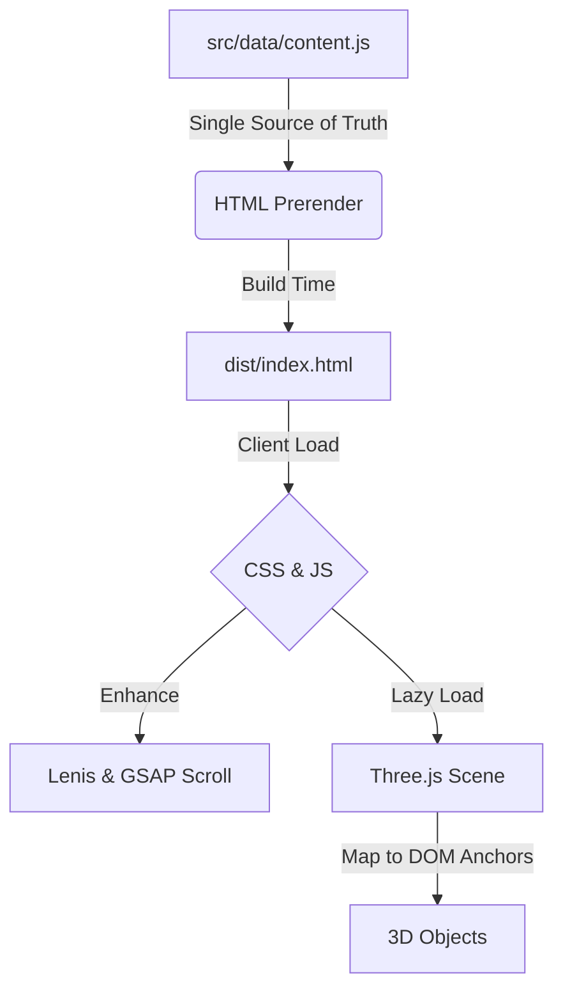

# Kuldeep Singh — Orrery Portfolio

> Live at: [https://kuldeep-singh-naruka.netlify.app/](https://kuldeep-singh-naruka.netlify.app/)

A light, scroll-driven 3D portfolio themed on space and code. The architecture is a "solar system" (orrery) of my skills, projects, and career history.

## 🏗 Architecture

The site operates on a principle of **progressive enhancement** and **content-first** design. 



1. **Content**: All text (verbatim from my resume) lives in `src/data/content.js` and is hardcoded into `index.html`.
2. **Scroll Choreography**: Lenis smooth scrolling is synced to GSAP's ticker. As you scroll, CSS backgrounds crossfade and HTML elements reveal themselves.
3. **3D Scene**: Three.js is lazy-loaded. Objects are positioned in the 3D world by tracking the screen bounds of empty `<div class="anchor">` elements in the DOM. This ensures 3D never overlaps text and scales perfectly on all devices.

## 🚀 Running Locally

```bash
npm install
npm run dev        # Local development server
npm run build      # Production build
npm run preview    # Preview production build locally
```

## 🧪 Verification

To ensure 100% resume fidelity, a Playwright test asserts that every string exists in the static HTML *and* is visibly rendered in the browser.

```bash
npm run verify:content
```

## 🛠 Tech Stack

* **Vite** — Build tool
* **Tailwind CSS v4** — CSS-first styling
* **Three.js** — Procedural WebGL objects and shaders
* **GSAP + ScrollTrigger** — Scroll timelines and object states
* **Lenis** — Smooth scrolling

## 📝 Key Decisions

1. **No React/Framework**: Built with Vanilla JS to keep the bundle as small as possible and maximize performance on the Netlify free tier.
2. **Anchor-Based 3D**: Instead of a complex 3D coordinate system, the 3D canvas sits behind the DOM and maps objects directly to CSS layout blocks (`getBoundingClientRect`). This guarantees the 3D never ruins text legibility.
3. **Adaptive Quality**: The WebGL scene monitors FPS and automatically drops pixel ratio or disables effects if performance suffers.
4. **Accessibility First**: Phone numbers are hidden from static HTML (anti-scraping) but assemble on click. Reduced motion is honored. Fallback CSS gradients appear if WebGL fails.